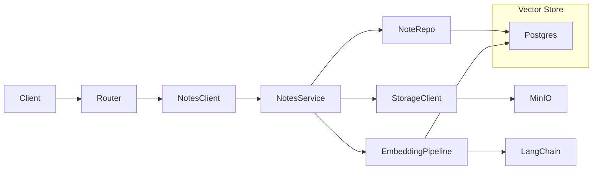

# Patient Notes API and Vector-Prepared Storage — Implementation Task Summary

Extend the API to accept patient notes (upload, list, delete), add Docker document storage (MinIO), LangChain embeddings and output format, and a vector DB migration (pgvector) for document chunks to support future LLM summaries. No update-note endpoint (delete and re-upload is sufficient).

## Context

### Input/Output Expectations

- Patient notes are short notes written by healthcare professionals during admission, check-ins, or doctor visits.
- They may be written in SOAP format (see example below).
- For simplicity, notes can track a patient from admission (chief complaints, family history, observations, medications) through routine check-ins to discharge.

### Stretch Goals (future work)

- Allow notes to be more than text (e.g. PDFs, handwritten notes).
- Classify the type of note being taken.
- Collect structured data about the patient.

### Out of Scope for Task 002

- Implementing the actual LLM summary endpoint (only prepare schema and vector storage).
- PDF parsing, note-type classification, and structured extraction (separate or optional tasks).
- Authentication/authorization (unless already in project scope).

### Example SOAP Note (reference)

```
SOAP Note - Encounter Date: 2023-10-26
Patient: patient--001

S: Pt presents today for annual physical check-up. No chief complaints. Reports generally good health, denies chest pain, SOB, HA, dizziness. Family hx of elevated cholesterol (dad), no significant personal PMH issues reported. States routine exercise (~2x/wk), balanced diet but with occasional fast-food. Denies tobacco use, reports occasional ETOH socially.

O:
Vitals:
BP: 128/82 mmHg
HR: 72 bpm, regular
RR: 16 breaths/min
Temp: 98.2°F oral
Ht: 5'10", Wt: 192 lbs, BMI: 27.5 (overweight)
General appearance: Alert, NAD, pleasant and cooperative.
Skin: Clear, normal moisture/turgor
HEENT: PERRLA, EOMI, no scleral icterus. Oral mucosa moist, throat clear, no erythema
CV: Regular rate & rhythm, no murmurs, rubs or gallops
Lungs: CTA bilaterally, no wheezing or crackles
ABD: Soft, NT/ND, bowel sounds normal
Neuro: CN II-XII intact, normal strength & sensation bilat
EXT: No edema, pulses +2 bilaterally
Labs ordered: CBC, CMP, Lipid panel

A:
Adult annual health exam, generally healthy
Possible overweight (BMI 27.5), recommend lifestyle modifications
Family hx of hyperlipidemia, screening initiated

P:
Advised pt on healthier diet, increasing weekly exercise frequency to at least 3-4 times/week
Scheduled follow-up visit to review lab results and cholesterol levels in approx. 5 months
Routine annual influenza vaccine administered today - tolerated well
No Rx prescribed at this visit.

Signed:
Dr. Mark Reynolds, MD
Internal Medicine
```

---

## Relevant Files

### Core Implementation Files

- `app/config.py` - Add DOCUMENT_STORAGE_* and VECTOR_* / embedding-related settings
- `app/shared/schemas/notes.py` - Note request/response/internal DTOs (upload body, list response, etc.)
- `app/shared/db/models/notes.py` - ORM model for notes table
- `app/shared/db/models/note_chunks.py` - ORM model for vector chunks (or in same module)
- `app/notes/domain.py` - Note domain entities / value objects
- `app/notes/interfaces/repositories/notes.py` - INoteRepository ABC
- `app/notes/repository.py` - NoteRepository (implements INoteRepository)
- `app/notes/interfaces/client/notes.py` - INoteClient ABC
- `app/notes/service.py` - NoteService (orchestration, uses repository, storage, optional embedding)
- `app/notes/client.py` - Public facade; receives deps via parameter; used by router
- `app/notes/router.py` - APIRouter for /patients/{patient_id}/notes; upload, list, delete
- `app/shared/storage/document_storage.py` - Document storage client (S3/MinIO) for file uploads
- `app/shared/llm/embeddings.py` - LangChain chunking, embedding, write to vector table
- `app/shared/schemas/summary.py` or `app/notes/schemas_output.py` - Pydantic output format for future LLM summary (SOAP-aligned or discharge summary contract)
- `pyproject.toml` - Add dependencies: langchain, embedding provider, pgvector/sqlalchemy support for vector, boto3 or minio for storage

### Integration Points

- `app/main.py` - Include notes router (e.g. under /patients or /notes)
- `app/core/container.py` - Register note repository, note service, document storage client, optional embedding pipeline; provide session and config
- `app/deps.py` - get_note_client (session, note repo, note service, storage)
- `docker-compose.yml` - Add MinIO (or S3-compatible) service; API env for endpoint, bucket, keys
- `app/patients/router.py` or `app/notes/router.py` - Notes routes may live under patients (nested) or at top level

### Documentation Files

- `README.md` - MinIO/document storage setup, new env vars (DOCUMENT_STORAGE_*, VECTOR_*), migration steps for pgvector
- `.env.example` - DOCUMENT_STORAGE_ENDPOINT, DOCUMENT_STORAGE_BUCKET, DOCUMENT_STORAGE_ACCESS_KEY, DOCUMENT_STORAGE_SECRET_KEY, optional embedding model/API keys
- `docs/notes-api.md` or README section - Notes API usage and SOAP context (optional)
- `CODEOWNERS` - Add ownership for new paths (e.g. app/notes/, app/shared/storage/)

### Test Files

- `tests/unit/shared/test_schemas_notes.py` - Note DTO validation
- `tests/unit/notes/test_domain_notes.py` - Domain logic
- `tests/unit/notes/test_service_notes.py` - NoteService with mocked repository and storage
- `tests/integration/notes/test_repository_notes.py` - NoteRepository with real DB
- `tests/integration/notes/test_vector_chunks.py` - Vector chunk persistence (pgvector) if applicable
- `tests/functional/test_notes_http.py` - HTTP: upload (body + file), list, delete; input validation and security-focused cases

---

## Architecture (high level)



---

## Tasks

- [ ] 1.0 **Document storage in Docker** — Add MinIO (or S3-compatible) service to docker-compose; expose env (endpoint, bucket, access/secret keys) for the API; optional healthcheck. Update API service to pass DOCUMENT_STORAGE_* env vars.
  - [ ] 1.1 Add MinIO service (image, ports, volumes, environment) to `docker-compose.yml`.
  - [ ] 1.2 Add DOCUMENT_STORAGE_* to `.env.example` and document in README.

- [ ] 2.0 **Notes data model and persistence** — Define notes table and ORM model; ensure patient exists before creating a note.
  - [ ] 2.1 Alembic migration: create `notes` table with `id`, `patient_id` (FK to patients), `recorded_at` (timestamp), `content` (text), optional `storage_key` (for file-backed notes), `created_at`; decide ON DELETE behavior for patient_id (CASCADE or RESTRICT).
  - [ ] 2.2 Add `NoteModel` in `app/shared/db/models/notes.py`; align with migration.

- [ ] 3.0 **Notes API** — Upload (timestamp + content via body or file), list all notes for a patient, delete a note.
  - [ ] 3.1 Add Pydantic schemas in `app/shared/schemas/notes.py` (e.g. NoteCreateRequest with recorded_at + content, NoteResponse, list response).
  - [ ] 3.2 Implement notes module: domain, INoteRepository + NoteRepository, NoteService (calls patient repo or client to validate patient exists), NoteClient, APIRouter (POST upload, GET list by patient_id, DELETE by note_id); support both request-body and file upload for content.
  - [ ] 3.3 Register note repository, service, and client in container; add get_note_client in deps; include notes router in main.py (e.g. prefix `/patients/{patient_id}/notes` or `/notes` with patient_id query/path).

- [ ] 4.0 **Vector DB migration for chunks** — Enable pgvector and add table for document chunks.
  - [ ] 4.1 Alembic migration: enable `vector` extension; create `note_chunks` table (e.g. `id`, `note_id` FK to notes, `content` text, `embedding` vector(dim), `metadata` jsonb or similar); add index for vector similarity search (e.g. ivfflat or hnsw).
  - [ ] 4.2 Add ORM model for note_chunks (or equivalent) and repository/layer to insert and query chunks.

- [ ] 5.0 **LangChain embeddings and output format** — Chunking, embeddings, and a defined output format for future LLM summary.
  - [ ] 5.1 Add LangChain and embedding provider (e.g. OpenAI, sentence-transformers) to pyproject.toml; implement module that loads note content, splits into chunks, generates embeddings, and writes to the vector table (pgvector).
  - [ ] 5.2 Define Pydantic “output format” (e.g. summary schema with SOAP-aligned or discharge-summary fields) as a contract for later LLM integration; document in code or docs.
  - [ ] 5.3 Optionally run embedding pipeline on note create/upload (sync or async); or document as “run on demand / job” for 002.

- [ ] 6.0 **Configuration and wiring** — Settings and container/deps for storage and embeddings.
  - [ ] 6.1 Extend `app/config.py` with document storage (endpoint, bucket, keys) and vector/embedding settings (model name, dimensions, API key if needed).
  - [ ] 6.2 Wire document storage client and optional embedding pipeline in container and deps so notes service can store files and optionally trigger chunking/embedding.

- [ ] 7.0 **Tests** — Unit, integration, and functional tests; security-focused cases.
  - [ ] 7.1 Unit: test_schemas_notes.py (validation), test_domain_notes.py, test_service_notes.py (mocked repo and storage).
  - [ ] 7.2 Integration: notes repository with test DB; vector chunk persistence if applicable.
  - [ ] 7.3 Functional: HTTP tests for upload (body and file), list, delete; input validation, 404 for missing patient/note; avoid logging PII/PHI.

- [ ] 8.0 **Documentation and compliance** — README, CODEOWNERS, security considerations.
  - [ ] 8.1 Update README with MinIO/vector env vars, how to run migrations (including pgvector), and notes API usage summary.
  - [ ] 8.2 Update CODEOWNERS for new paths (app/notes/, app/shared/storage/, etc.).
  - [ ] 8.3 Document security considerations: PII/PHI in notes, access control, storage credentials, and input validation (OWASP-aligned).

---

**Usage:** Implement tasks in order 1.0 → 8.0. Sub-tasks (1.1, 1.2, …) can be done in parallel where there are no dependencies.
