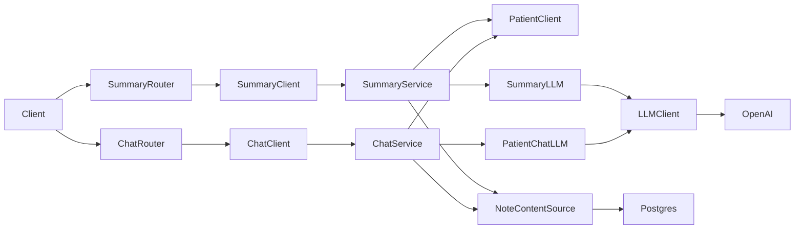

# Patient Summary and Chat — Implementation Task Summary

Add `GET /patients/{id}/summary` (patient heading + SOAP summary) and `POST /patients/{id}/chat` (Q&A about the patient). Summary and chat are **independent clients and routes**: each has its own module (`app/summary/`, `app/chat/`), interface (ISummaryClient, IChatClient), client, service, and router—same pattern as notes/patients. Both use patient metadata and note content; an LLM generates the summary or answers. This gives the care team a quick, accurate picture of the patient and allows questions over their data.

## Context

### Input/Output Expectations

- **Summary:** Input = patient metadata (from existing patient API) and notes (from notes API). Output = JSON with `patient_heading` (name, age, document_number) and a **SOAP-structured summary** (subjective, objective, assessment, plan).
- **Chat:** Input = `patient_id` + body `{ "message": "..." }`. Output = `{ "response": "..." }`. Stateless per request; no conversational history.

### Stretch Goals (future work)

- Summary customization (e.g. audience: family vs clinicians, or length/verbosity).
- Chat history or streaming later if desired.

### Out of Scope for Task 003

- Authentication/authorization (unless already in project scope).
- Changing existing patient/notes APIs.

### SOAP Format for Summary Output

SOAP stands for:

- **Subjective (S)** — The patient's reported symptoms, history, chief complaints, and statements.
- **Objective (O)** — The clinician's observations, exam findings, vitals, and test results.
- **Assessment (A)** — The clinician's diagnoses or summary of the case.
- **Plan (P)** — The treatment plan, medications, follow-up, and next steps.

The summary endpoint must use a **prompt** that instructs the LLM to synthesize the patient's notes into a single, coherent SOAP note. The API response must expose these four sections (e.g. via `PatientSummaryResponse` with `patient_heading` plus `subjective`, `objective`, `assessment`, `plan`).

**Example reference:** An example SOAP note is provided in the repo at `docs/examples/soap_01.txt`. Use it as the expected output format and as a few-shot example in the prompt. The example shows: heading (encounter date, patient id), then S / O / A / P blocks with clear labels and concise clinical content.

---

## Relevant Files

**Design principle:** Put in **shared** only what can be generalized (e.g. a generic LLM client interface and implementation). Module-specific behavior (SOAP prompt, chat Q&A prompt, parsing) lives inside **app/summary/** and **app/chat/**. The shared LLM client is used inside each module via the **ILLMClient** interface injected via deps.

### Core Implementation Files

**Summary (GET /patients/{id}/summary) — independent client and route, SOAP output**

- `app/summary/interfaces/client/summary.py` — **ISummaryClient** with `async def get_summary(patient_id: UUID, ...) -> PatientSummaryResponse`.
- `app/summary/client.py` — **SummaryClient(ISummaryClient)** delegating to SummaryService.
- `app/summary/service.py` — **SummaryService**: ensure patient exists, get note content, call ISummaryLlm with SOAP prompt, return PatientSummaryResponse.
- `app/summary/router.py` — Dedicated **summary router**; route `GET /patients/{patient_id}/summary` (e.g. prefix `/patients`, then `/{patient_id}/summary`), inject SummaryClient via deps.
- `app/shared/schemas/summary.py` — **PatientSummaryResponse** with patient_heading (name, age, document_number), subjective, objective, assessment, plan, generated_at, note_ids. Keep SOAPSummaryOutput/Discharge for reference.
- **Summary prompt:** Implement a prompt (in ISummaryLlm impl) that produces SOAP output (S/O/A/P); optionally use `docs/examples/soap_01.txt` as few-shot.

**Chat (POST /patients/{id}/chat) — independent client and route**

- `app/chat/interfaces/client/chat.py` — **IChatClient** with `async def send(patient_id: UUID, message: str) -> ChatResponse`.
- `app/chat/client.py` — **ChatClient(IChatClient)** delegating to ChatService.
- `app/chat/service.py` — **ChatService**: ensure patient exists, get note content for patient, build context, call **IPatientChatLlm.answer(patient_context, user_message)**.
- `app/chat/router.py` — `POST /patients/{patient_id}/chat` with `ChatRequest` / `ChatResponse`.
- `app/shared/schemas/chat.py` — `ChatRequest` (message), `ChatResponse` (response).

**Shared (generalized only)**

- **Note content** — One way to get full note text for a patient (from **note_chunks** ordered by chunk index). Add e.g. `INoteChunkRepository` or a method on note service/client: `get_note_contents_for_patient(patient_id)` so summary and chat both reuse it.
- **Generic LLM client** — Reusable across modules; no SOAP- or chat-specific logic in shared.
  - `app/shared/interfaces/llm/client.py` — **ILLMClient** (e.g. `async def invoke(system: str, user: str) -> str` or `complete(messages: list) -> str`). Abstract interface for "call LLM with messages and get text back."
  - `app/shared/llm/client.py` — **LLMClient** implementation (wraps LangChain ChatOpenAI); injected via deps. Config: `OPENAI_API_KEY`, optional model name in `app/config.py`.
- Put in **shared** only what can be generalized; module-specific prompts and parsing stay in their modules.

**Summary module (SOAP prompt and parsing inside module)**

- `app/summary/interfaces/llm/summary.py` — **ISummaryLlm** (e.g. `async def generate_soap(patient_context: str) -> tuple[str, str, str, str]` for S/O/A/P). Module-specific interface.
- `app/summary/llm.py` — **SummaryLlm** implementation: depends on **ILLMClient** (injected via deps), builds SOAP prompt (optionally using `docs/examples/soap_01.txt` as few-shot), calls `llm_client.invoke(system, user)`, parses response into four SOAP sections. All SOAP logic lives in the summary module.

**Chat module (Q&A prompt inside module)**

- `app/chat/interfaces/llm/chat.py` — **IPatientChatLlm** (e.g. `async def answer(patient_context: str, user_message: str) -> str`). Module-specific interface.
- `app/chat/llm.py` — **PatientChatLlm** implementation: depends on **ILLMClient** (injected via deps), builds prompt (context + user message), calls `llm_client.invoke(system, user)`, returns response string. All chat prompt logic lives in the chat module.

### Integration Points

- `app/main.py` — Include **summary_router** and **chat_router** (each independent). Routes: GET /patients/{patient_id}/summary (summary router), POST /patients/{patient_id}/chat (chat router); mount with prefix or define paths so URLs are as above.
- `app/deps.py` — **get_summary_client** (builds SummaryService with IPatientClient, note content source, ISummaryLlm; SummaryLlm receives ILLMClient via deps; returns SummaryClient); **get_chat_client** (builds ChatService; PatientChatLlm receives ILLMClient via deps; returns ChatClient). Register shared **ILLMClient** (or factory) so summary and chat modules receive it by injection.
- `app/core/container.py` — Register shared LLM client (factory) if used; modules use it via interface.

### Documentation Files

- `README.md` — Summary and chat endpoints; OPENAI_* env vars.
- `.env.example` — OPENAI_API_KEY, optional OPENAI_SUMMARY_MODEL, OPENAI_CHAT_MODEL.
- `CODEOWNERS` — Add ownership for `app/summary/`, `app/chat/`.

### Test Files

- `tests/unit/shared/test_schemas_summary.py` — PatientSummaryResponse validation.
- `tests/unit/shared/test_schemas_chat.py` — ChatRequest/ChatResponse validation.
- `tests/unit/summary/test_service_summary.py` — SummaryService with mocked deps and ISummaryLlm.
- `tests/unit/summary/test_llm_summary.py` — SummaryLlm with mocked ILLMClient (SOAP prompt building and parsing).
- `tests/unit/chat/test_service_chat.py` — ChatService with mocked deps and IPatientChatLlm.
- `tests/unit/chat/test_llm_chat.py` — PatientChatLlm with mocked ILLMClient.
- `tests/functional/test_summary_http.py` — GET /patients/{id}/summary (200, 404, structure).
- `tests/functional/test_chat_http.py` — POST /patients/{id}/chat (200, 404, body validation); no PII/PHI in logs.

---

## Architecture (high level)

---

## Tasks

- [ ] 1.0 **Schemas** — PatientSummaryResponse in summary.py with patient_heading + SOAP fields (subjective, objective, assessment, plan), generated_at, note_ids; ChatRequest/ChatResponse in chat.py.

- [ ] 2.0 **Note content for context** — Provide a way to get full note text per patient (note_chunks ordered by chunk index). INoteChunkRepository or get_note_contents_for_patient on note layer so summary and chat both reuse it.

- [ ] 3.0 **Shared LLM client and module-specific LLM use** — Generic LLM in shared; SOAP and chat prompts inside their modules, using shared client via interface injected via deps.
  - [ ] 3.1 **Shared:** Add `app/shared/interfaces/llm/client.py` (**ILLMClient**, e.g. `invoke(system, user) -> str`); implement `app/shared/llm/client.py` (wraps ChatOpenAI). Config: OPENAI_API_KEY, optional model.
  - [ ] 3.2 **Summary module:** Add `app/summary/interfaces/llm/summary.py` (**ISummaryLlm**); implement `app/summary/llm.py` (**SummaryLlm**: depends on ILLMClient, builds SOAP prompt, parses S/O/A/P). Use docs/examples/soap_01.txt for prompt design.
  - [ ] 3.3 **Chat module:** Add `app/chat/interfaces/llm/chat.py` (**IPatientChatLlm**); implement `app/chat/llm.py` (**PatientChatLlm**: depends on ILLMClient, builds Q&A prompt). Wire ILLMClient into both modules via deps.

- [ ] 4.0 **Summary (independent client and route)** — ISummaryClient, SummaryClient, SummaryService, **summary_router** with GET /patients/{patient_id}/summary; deps **get_summary_client**; prompt produces SOAP output; response = patient_heading + four SOAP sections; 404 if patient missing.
  - [ ] 4.1 Implement `app/summary/interfaces/client/summary.py`, `app/summary/client.py`, `app/summary/service.py`, `app/summary/router.py`.
  - [ ] 4.2 Register get_summary_client in deps; include summary_router in main.py (path GET /patients/{patient_id}/summary).

- [ ] 5.0 **Chat (independent client and route)** — IChatClient, ChatClient, ChatService, **chat_router** with POST /patients/{patient_id}/chat; deps **get_chat_client**; 404 if patient missing.
  - [ ] 5.1 Implement `app/chat/interfaces/client/chat.py`, `app/chat/client.py`, `app/chat/service.py`, `app/chat/router.py`.
  - [ ] 5.2 Register get_chat_client in deps; include chat_router in main.py (path POST /patients/{patient_id}/chat).

- [ ] 6.0 **Stretch — Summary customization** — Optional query params (e.g. audience=clinician|family, length=brief|detailed) for summary; pass through to prompt or model.

- [ ] 7.0 **Tests** — Unit (schemas, SummaryService and ChatService with mocks); functional (GET summary 200/404, POST chat 200/404, body validation, no PII in logs).
  - [ ] 7.1 Unit: test_schemas_summary.py, test_schemas_chat.py, test_service_summary.py, test_service_chat.py, test_llm_summary.py (SummaryLlm + mocked ILLMClient), test_llm_chat.py (PatientChatLlm + mocked ILLMClient); optional test for shared LLMClient.
  - [ ] 7.2 Functional: test_summary_http.py, test_chat_http.py.

- [ ] 8.0 **Documentation and compliance** — README, .env.example, CODEOWNERS; PHI/API key security.
  - [ ] 8.1 Update README with summary and chat endpoints and OPENAI_* vars.
  - [ ] 8.2 Update CODEOWNERS for app/summary/, app/chat/.
  - [ ] 8.3 Document security considerations: PHI in summary/chat responses, API key handling, input size limits (OWASP-aligned).

---

**Usage:** Implement tasks in order 1.0 → 8.0. Sub-tasks can be done in parallel where there are no dependencies.
