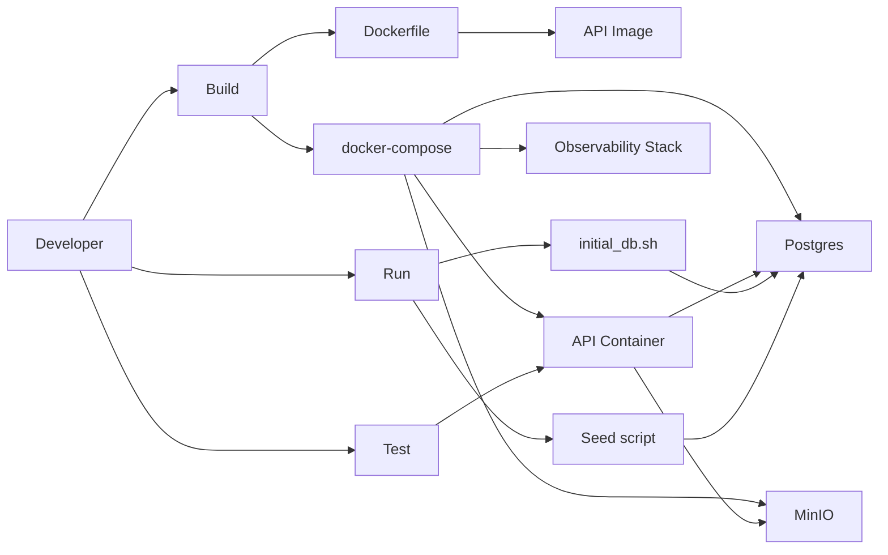

# Containerization and Deployment — Implementation Task Summary

**Part 4: Containerization and Deployment.** Containerize the Healthcare Data Processing API and set up a complete local development environment. The application already has a multi-stage Dockerfile, docker-compose (API, Postgres, MinIO, OpenTelemetry stack), and `.env.example`; this task formalizes requirements, fills gaps (e.g. sample data seeding), and adds documentation and optional stretch goals (dev/prod configs, CI, K8s, automated testing).

## Context

### Current state

| Requirement           | Status   | Notes |
|-----------------------|----------|--------|
| Dockerfile            | Done     | Multi-stage, Python 3.12-slim, uv, exposes 8000 |
| docker-compose        | Done     | api, postgres (pgvector), minio + provision, otelcol, prometheus, loki, tempo, grafana |
| .env / .env.example  | Done     | DB, OTEL, MinIO, OpenAI, ENVIRONMENT |
| DB init (migrations)  | Done     | `scripts/initial_db.sh` + `scripts/wait_for_db.py`; no sample data |
| Build/run/test docs   | Partial  | README has Docker Compose run; can add explicit "containerized only" workflow |
| Prometheus / monitoring | Done  | In compose; observability configs in `observability/` |

### Out of scope for Task 004

- Changing application business logic or API contracts.
- Production hosting or cloud provider specifics (beyond local K8s stretch).

### Security

- Do not commit `.env` or secrets; use `.env.example` as reference only.
- No secrets in Docker images; use env vars at runtime.
- README Security section and CODEOWNERS remain the source for security contact and practices.

---

## Relevant Files

### Core Implementation Files

- `Dockerfile` — Multi-stage build: builder (uv sync), runtime (slim image, venv, uvicorn on 8000).
- `docker-compose.yml` — Services: api, postgres (pgvector), minio, minio-provision, otelcol, prometheus, loki, tempo, grafana; api depends on postgres healthcheck and minio-provision.
- `.env.example` — Example env vars for DB, OTEL, MinIO, OpenAI, ENVIRONMENT; copy to `.env` and never commit.
- `scripts/initial_db.sh` — Loads .env, waits for Postgres, runs `alembic upgrade head`; run after compose up.
- `scripts/wait_for_db.py` — Async wait for PostgreSQL using app Settings; used by `initial_db.sh`.

### Integration Points

- `app/main.py` — FastAPI app entrypoint; container runs `uvicorn app.main:app`.
- `app/config.py` — Pydantic BaseSettings; all env vars (DATABASE_URL, OTEL_*, DOCUMENT_STORAGE_*, etc.) consumed here.
- `observability/otelcol-config.yml` — OTel Collector config; mounted by compose for api → otelcol.
- `observability/prometheus.yml` — Prometheus scrape config (e.g. otelcol metrics).
- `observability/grafana/provisioning/` — Grafana datasources/dashboards used by compose.

### Documentation Files

- `README.md` — Setup, run (local and Docker Compose), testing, security; add/update containerized build/run/test subsection.
- `docs/tasks/004-containerization-and-deployment.md` — This task document.

---

## Architecture (containerized flow)

---

## Tasks

- [x] 1.0 **Dockerfile** — Verify or update the Dockerfile (appropriate Python base image, multi-stage, non-root user optional). Ensure it builds and the app runs with `docker compose up`.
  - [x] 1.1 Confirm Python 3.12-slim (or current supported version) and multi-stage build with uv.
  - [x] 1.2 Optionally add non-root user for runtime stage; document in README if added.

- [x] 2.0 **docker-compose** — Verify compose includes the FastAPI application, database, and any other required services (MinIO, OTel Collector, etc.). Document profiles or overrides if introduced.
  - [x] 2.1 Confirm services: api, postgres (with healthcheck), minio, minio-provision, otelcol, prometheus, loki, tempo, grafana.
  - [x] 2.2 Document how to run with or without observability stack if profiles are added later.

- [x] 3.0 **Environment variables** — Configure environment variables using `.env` files; maintain a complete `.env.example` (no secrets). Document required vs optional vars.
  - [x] 3.1 Ensure `.env.example` includes DATABASE_URL (or POSTGRES_*), OTEL_*, DOCUMENT_STORAGE_*, OPENAI_*, ENVIRONMENT.
  - [x] 3.2 README or this task doc references that `.env` must not be committed; use `.env.example` as reference.

- [x] 4.0 **DB init and sample data** — Keep migration-based init; add scripts to optionally initialize the database with sample data on startup (or after first run).
  - [x] 4.1 Keep `scripts/initial_db.sh` for waiting for Postgres and running `alembic upgrade head`.
  - [x] 4.2 Add a seed script (e.g. `scripts/seed_sample_data.py` or `scripts/seed_db.sh`) that creates sample patients and notes (e.g. for demo or local dev).
  - [x] 4.3 Document when to run the seed script: e.g. after `./scripts/initial_db.sh`, or via optional env (e.g. `SEED_DB=true`) in an entrypoint wrapper if desired. Do not overwrite existing data by default.

- [x] 5.0 **Documentation** — Include detailed documentation on how to build, run, and test the containerized application.
  - [x] 5.1 **Build:** e.g. `docker compose build` (or `docker build -t healthcare-api .`).
  - [x] 5.2 **Run:** e.g. `docker compose up -d`, then run `./scripts/initial_db.sh` (and optionally the seed script); list key ports (API :8000, Grafana :3000, Prometheus :9090, etc.).
  - [x] 5.3 **Test:** How to run tests against the containerized app (e.g. `docker compose run api uv run pytest tests/unit/ tests/functional/` or run pytest on host against API on :8000); document any skipped tests that need DB or MinIO.

- [x] 6.0 **Stretch — Dev vs production** — Set up different configurations for development and production (e.g. `docker-compose.override.yml` for dev, `docker-compose.prod.yml` or compose profiles for production-like settings).

- [x] 7.0 **Stretch — CI pipeline** — Create a CI pipeline configuration file (e.g. GitHub Actions under `.github/workflows/`) for build, test, and lint.

- [x] 8.0 **Stretch — Monitoring** — Document and verify monitoring (Prometheus metrics, Grafana dashboards); optionally add one SLO-oriented dashboard or metric.

- [x] 9.0 **Stretch — Local Kubernetes** — Use a local Kubernetes setup instead of docker compose, with manifests for API, DB, and optional services. Prefer **k3s** for this goal: it is lightweight and suited to a long-lived local dev environment on a single machine. (Use kind for CI/ephemeral clusters instead.)

- [x] 10.0 **Stretch — Automated testing on GitHub** — Run automated tests using GitHub Actions (or similar) on push/PR (e.g. pytest on GitHub runners).

---

**Usage:** Implement tasks in order 1.0 → 5.0 for the core deliverable; stretch goals 6.0–10.0 are optional. Sub-tasks can be done in parallel where there are no dependencies.
